# Modelo Entidad-Relacion

## Diagrama

```mermaid
erDiagram
  companies ||--o{ sites : has
  users }o--|| companies : belongs_to
  suppliers ||--o{ equipment : owns
  suppliers ||--o{ contracts : signs
  sites ||--o{ equipment : assigns
  sites ||--o{ contracts : applies_to
  contracts ||--o{ contract_equipment : includes
  equipment ||--o{ contract_equipment : included_in
  contracts ||--o{ valuations : generates
  valuations ||--|| invoices : billed_by
  suppliers ||--o{ invoices : issues
  contracts ||--o{ invoices : groups
  invoices ||--o{ invoice_attachments : has
  invoices ||--o{ alerts : triggers
  users ||--o{ audit_logs : performs

  companies {
    uuid id PK
    string legal_name
    string ruc
    string country
    string base_currency
    string timezone
    datetime created_at
    datetime updated_at
  }

  users {
    uuid id PK
    uuid company_id FK
    string name
    string email
    string password_hash
    string role
    boolean is_active
    datetime last_login_at
    datetime created_at
    datetime updated_at
  }

  sites {
    uuid id PK
    uuid company_id FK
    string name
    string address
    boolean is_active
    datetime created_at
    datetime updated_at
  }

  suppliers {
    uuid id PK
    string business_name
    string trade_name
    string ruc
    string contact_name
    string phone
    string email
    string address
    string bank_name
    string bank_account_number
    int default_payment_term_days
    string status
    datetime created_at
    datetime updated_at
  }

  equipment_types {
    uuid id PK
    string name
    boolean is_active
    datetime created_at
    datetime updated_at
  }

  equipment {
    uuid id PK
    uuid supplier_id FK
    uuid equipment_type_id FK
    uuid current_site_id FK
    string description
    string brand
    string model
    int year
    string plate_or_internal_code
    string status
    datetime created_at
    datetime updated_at
  }

  contracts {
    uuid id PK
    uuid supplier_id FK
    uuid site_id FK
    string contract_number
    date start_date
    date end_date
    string billing_mode
    decimal rate
    string currency
    string valuation_mode
    string valuation_period
    int invoice_due_days
    string notes
    string status
    datetime created_at
    datetime updated_at
  }

  contract_equipment {
    uuid contract_id FK
    uuid equipment_id FK
    datetime created_at
  }

  valuations {
    uuid id PK
    uuid contract_id FK
    uuid equipment_id FK
    string valuation_number
    date period_start
    date period_end
    date cutoff_date
    decimal quantity
    decimal unit_rate
    decimal calculated_amount
    string currency
    string status
    string notes
    datetime created_at
    datetime updated_at
  }

  invoices {
    uuid id PK
    uuid supplier_id FK
    uuid contract_id FK
    uuid valuation_id FK
    string invoice_number
    date issue_date
    date due_date
    string currency
    decimal total_amount
    string status
    date paid_at
    date payment_extension_date
    string payment_extension_reason
    string notes
    datetime created_at
    datetime updated_at
  }

  invoice_attachments {
    uuid id PK
    uuid invoice_id FK
    string file_name
    string file_type
    int file_size_bytes
    string storage_key
    datetime created_at
  }

  alerts {
    uuid id PK
    uuid invoice_id FK
    string alert_type
    date trigger_date
    boolean is_seen
    boolean is_resolved
    datetime email_sent_at
    datetime whatsapp_sent_at
    datetime created_at
    datetime updated_at
  }

  audit_logs {
    uuid id PK
    uuid user_id FK
    string entity_type
    uuid entity_id
    string action
    json metadata
    datetime created_at
  }
```



## Enumeraciones sugeridas

- `user.role`: ADMIN, OPERATIVO
- `supplier.status`: ACTIVO, INACTIVO
- `equipment.status`: EN_OBRA, DISPONIBLE, FINALIZADO
- `contract.billing_mode`: HORA, DIA
- `contract.currency`: PEN, USD
- `contract.valuation_mode`: POR_VALORIZACION, POR_PERIODO
- `contract.valuation_period`: SEMANAL, QUINCENAL, MENSUAL, PERSONALIZADO
- `contract.status`: ACTIVO, FINALIZADO, CANCELADO
- `valuation.status`: PENDIENTE_FACTURA, FACTURADO, PAGADO
- `invoice.status`: PENDIENTE, PAGADA, VENCIDA, OBSERVADA
- `alert.alert_type`: PROXIMO_VENCIMIENTO, VENCIDA

## Indices recomendados

- `suppliers.ruc` unico.
- `contracts.contract_number` unico.
- `equipment.plate_or_internal_code` unico cuando exista.
- `invoices.invoice_number` + `supplier_id` unico.
- `invoices.valuation_id` unico para asegurar relacion uno a uno.
- `invoices.due_date`, `invoices.status`.
- `contracts.supplier_id`, `contracts.site_id`, `contracts.status`.
- `valuations.contract_id`, `valuations.status`.
- `valuations.equipment_id`.
- `alerts.invoice_id`, `alerts.is_resolved`.

## Estructura documental local

Primera version: servidor propio con carpetas visibles.

```text
ISEM/
  proveedores/
    {ruc-proveedor}-{nombre-normalizado}/
      ficha/
      contratos/
        {numero-contrato}/
          contrato/
          orden-servicio/
          valorizaciones/
            {numero-valorizacion}/
              valorizacion-proveedor/
              factura/
              comprobante-pago/
              otros/
      equipos/
        {placa-o-codigo}/
          documentos/
          fotos/
  reportes/
    {anio}/
      {mes}/
```

La base de datos debe registrar cada archivo aunque exista una carpeta visible. La carpeta visible ayuda al equipo operativo; la base de datos mantiene busqueda, permisos, trazabilidad y futura migracion a Supabase.
